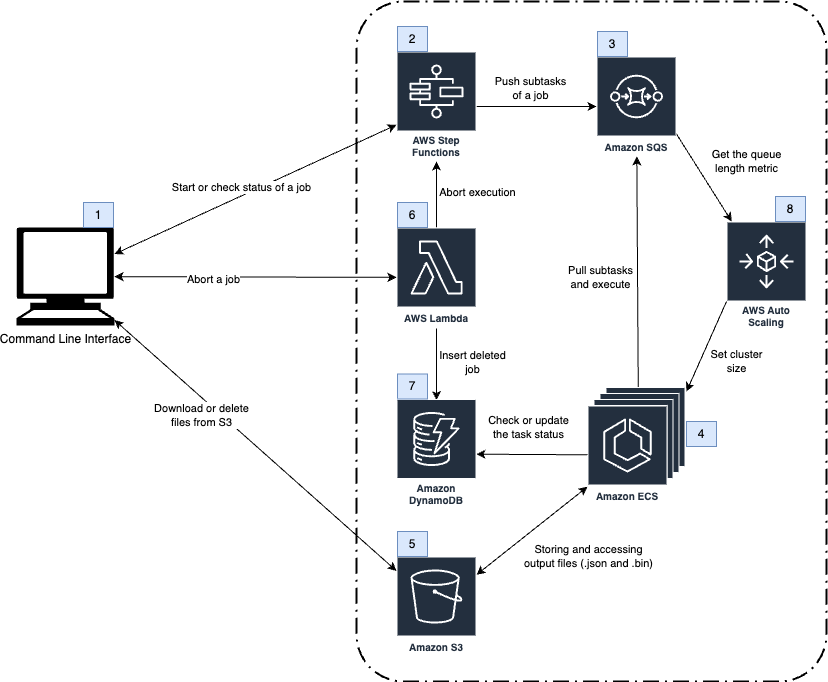
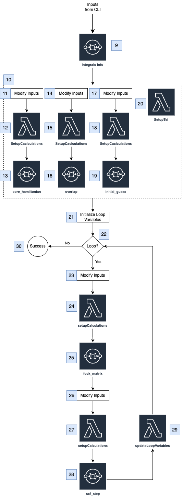

# electron-repulsion

Orchestration for calculating electron repulsion integrals in the cloud

| Index                                                 | Description                                               |
|:------------------------------------------------------|:----------------------------------------------------------|
| [High Level Architecture](#High-Level-Architecture)   | Architecture of the system                                |
| [Deployment](#deployment)                             | How to deploy the system                                  |
| [User Guide](#User-Guide)                             | Running and managing jobs                                 |
| [Changelog](#Changelog)                               | Any changes post publish                                  |
| [License](#License)                                   | License details                                           |

# High Level Architecture

The overall cloud architecture can be summarized as follows.

The next image shows the step function workflow that runs calculations.

# Deployment

To deploy this solution, please follow our [Deployment Guide](docs/deployment.md).

# User Guide

For instructions about using the solution, visit the [User Guide](docs/user_guide.md).

# Changelog

N/A

# License

This project is distributed under the [MIT License](LICENSE).
